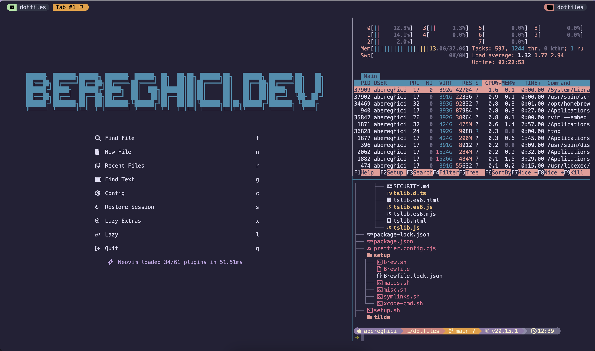

# ~abereghici 🌶️

My personal dotfiles for configuring macOS with Zsh and Homebrew.

> [!IMPORTANT] Please only open pull requests that fix bugs or add improvements
> without any breaking changes.



> [!WARNING] I recommend forking this repository to create your own set of
> dotfiles.

## Requirements

- macOS
- Homebrew (the install script will install Homebrew)
- Zsh (the install script will install Zsh via Homebrew)

## What's in there?

- Handy [binary scripts](bin/).
- [Custom zsh theme](tilde/.starship.toml) with Git status, etc. using
  [Starship](https://starship.rs/).
- [Git aliases](tilde/.gitconfig).
- [Shell aliases](zsh/aliases.zsh).
- zsh / [fzf](zsh/fzf.zsh).
- git / delta syntax-highlighting diff tool.
- Sensible [macOS defaults](setup/macos.sh).
- [Neovim](tilde/.config/nvim/)
- [Zellij](./tilde/.config/zellij/)
- [Alacritty](./tilde/.config/alacritty/)
- [Wezterm](./tilde/.config/wezterm/)
- [macOS apps](setup/Brewfile) I use.

## Installation

1. Enable **Firewall** under **System Settings** → **Network**
1. Point the DNS Servers to [Cloudflare DNS](https://one.one.one.one/dns/)
   - `1.1.1.1`
   - `1.0.0.1`
   - `2606:4700:4700::1111`
   - `2606:4700:4700::1001`
1. Configure Git and GitHub SSH

   1. [Generate SSH key and add it to the ssh-agent](https://docs.github.com/en/authentication/connecting-to-github-with-ssh/generating-a-new-ssh-key-and-adding-it-to-the-ssh-agent)
   1. [Add your public SSH key to GitHub account](https://docs.github.com/en/authentication/connecting-to-github-with-ssh/adding-a-new-ssh-key-to-your-github-account)
   1. Test your authentication with:

      ```bash
      ssh -T git@github.com
      ```

1. Choose _manual_ or _automatic_ dotfiles installation below

### Manually

```shell
git clone git@github.com:abereghici/dotfiles.git ~/dotfiles
cd ~/dotfiles
./setup/brew.sh
./setup/misc.sh
./setup/symlinks.sh
```

### Automatically

To automate the setup of your dotfiles on a new machine, use the
[setup](./setup.sh) script.

> [!CAUTION] Use at your own risk!

```shell
git clone git@github.com:abereghici/dotfiles.git ~/dotfiles
~/dotfiles/setup.sh
```

This will install all required dotfiles in your home directory as symlinks.
Everything is then configured via modifying files in `~/dotfiles`.

## Extras

### Set macOS defaults

```shell
./setup/macos.sh
```

## Local customizations

The dotfiles can be extended to suit additional local requirements by using the
following files:

### `~/.zsh.local`

If this file exists, it will be automatically sourced after all the other shell
related files allowing its content to add to or overwrite the existing aliases,
settings, PATH, etc.

### `~/.gitconfig.local`

If this file exists, it will be automatically included after the configurations
from `~/.gitconfig` allowing its content to overwrite or add to the existing
`git` configurations.

> [!TIP] Use `~/.gitconfig.local` to store [sensitive information](git/) such as
> the `git` user credentials for individual repositories.

## Updating

To update an existing install:

```shell
cd ~/dotfiles
git pull
./setup.sh
```

## License

MIT License.

## Inspiration

- [nicksp/dotfiles](https://github.com/nicksp/dotfiles)
- [holman/dotfiles](https://github.com/holman/dotfiles)
- [mathiasbynes/dotfiles](https://github.com/mathiasbynens/dotfiles)
- [sapegin/dotfiles](https://github.com/sapegin/dotfiles)
- <https://remysharp.com/2018/08/23/cli-improved>
- <https://evanhahn.com/a-decade-of-dotfiles>
- <https://cpojer.net/posts/set-up-a-new-mac-fast>
- <https://thevaluable.dev/zsh-install-configure-mouseless/>
